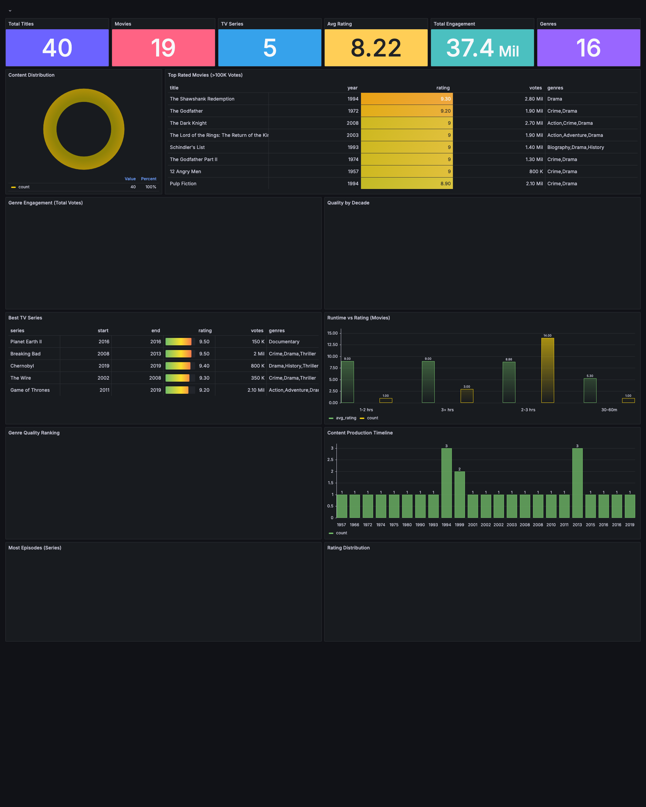
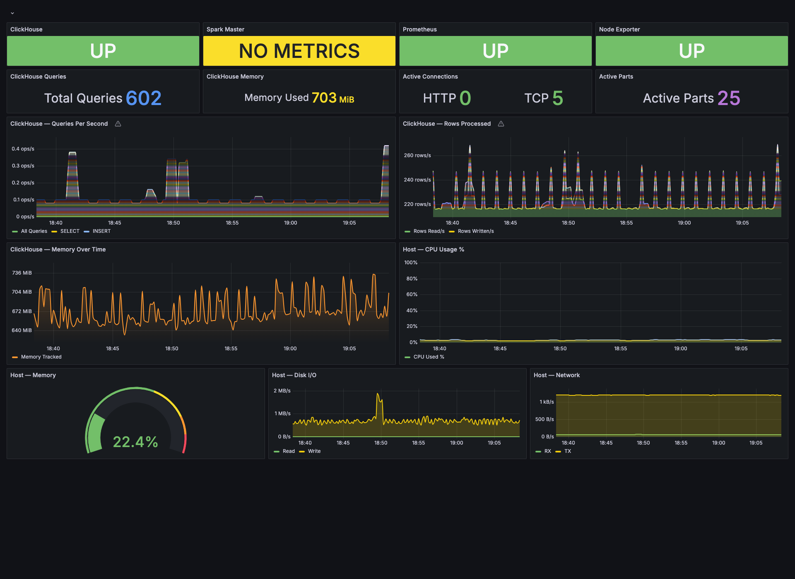

# IMDb Lakehouse to OLAP Pipeline

## Table of Contents
- [Overview](#overview)
- [Architecture](#architecture)
- [Tech Selection & Comparison](#tech-selection--comparison)
- [High-Level Design (HLD)](#high-level-design-hld)
- [Low-Level Design (LLD)](#low-level-design-lld)
- [Scalability Considerations](#scalability-considerations)
- [Performance Benchmarks](#performance-benchmarks)
- [Quick Start](#quick-start)
- [Project Structure](#project-structure)

---

## Overview

This project implements a local data pipeline that:
1. Downloads the 2GB IMDb dataset from Kaggle
2. Processes it using PySpark (cleansing, transformation, partitioning)
3. Saves data as Snappy-compressed, partitioned Parquet files (the "Lake")
4. Loads data into ClickHouse (OLAP engine) for sub-second analytical queries

The pipeline demonstrates how Teleparty-scale event data (hundreds of millions of rows) can be processed efficiently through a Lakehouse architecture with an OLAP serving layer.

---

## Architecture

```
┌─────────────────────────────────────────────────────────────────────────────┐
│                        IMDb Lakehouse → OLAP Pipeline                       │
├─────────────────────────────────────────────────────────────────────────────┤
│                                                                             │
│  ┌──────────┐     ┌──────────────────┐     ┌─────────────┐     ┌────────┐ │
│  │  Kaggle  │────▶│   PySpark ETL    │────▶│  Parquet    │────▶│ Click- │ │
│  │  IMDb    │     │  (Spark Cluster) │     │  Lake       │     │ House  │ │
│  │  Dataset │     │                  │     │  (Snappy)   │     │ (OLAP) │ │
│  └──────────┘     └──────────────────┘     └─────────────┘     └────────┘ │
│       │                    │                       │                  │     │
│       │           ┌────────┴────────┐              │                  │     │
│       │           │  • Clean nulls  │              │                  │     │
│       │           │  • Type casting │    Partitioned by:       Analytics│    │
│       │           │  • Dedup        │    • title_type            Queries│    │
│       │           │  • Join tables  │    • start_year                  │     │
│       │           │  • Partition    │              │                  │     │
│       │           └─────────────────┘              │                  │     │
│       ▼                                            ▼                  ▼     │
│  data/raw/                                   data/lake/         Sub-second  │
│  (TSV files)                                 (Parquet)          queries     │
│                                                                             │
└─────────────────────────────────────────────────────────────────────────────┘
```

### Container Architecture (Podman Compose)

```
┌─────────────────────────────────────────────────────────────────┐
│                     Podman Network: imdb-pipeline                │
├─────────────────────────────────────────────────────────────────┤
│                                                                  │
│  ┌──────────────┐    ┌──────────────┐    ┌──────────────────┐  │
│  │ spark-master │    │ spark-worker │    │   clickhouse     │  │
│  │              │    │              │    │                  │  │
│  │ Port: 8080   │    │ 2 cores      │    │ Port: 8123 (HTTP)│  │
│  │ Port: 7077   │    │ 2GB RAM      │    │ Port: 9000 (TCP) │  │
│  │              │    │              │    │                  │  │
│  └──────┬───────┘    └──────┬───────┘    └────────┬─────────┘  │
│         │                   │                     │             │
│         └─────────┬─────────┘                     │             │
│                   │                               │             │
│         ┌─────────▼─────────────────────────────▼──────┐       │
│         │          Shared Volume: ./data                 │       │
│         │  raw/ → lake/ → (mounted in ClickHouse)       │       │
│         └────────────────────────────────────────────────┘       │
│                                                                  │
└──────────────────────────────────────────────────────────────────┘
```

---

## Tech Selection & Comparison

### OLAP Engine: ClickHouse

| Criteria | ClickHouse | Apache Druid | DuckDB | StarRocks |
|----------|-----------|--------------|--------|-----------|
| **Query Latency** | Sub-second on billions of rows | Sub-second (optimized for time-series) | Fast for single-node | Sub-second |
| **Local Docker Support** | ✅ Excellent | ⚠️ Complex (ZooKeeper + multiple services) | ✅ Embedded | ⚠️ Moderate |
| **Parquet Integration** | ✅ Native `file()` engine | ⚠️ Requires ingestion task | ✅ Native | ✅ Native |
| **Column Compression** | LZ4/ZSTD, best-in-class | Moderate | Good | Good |
| **Community & Docs** | Large, active | Large but enterprise-focused | Growing | Smaller |
| **Resource Footprint** | Low (~512MB minimum) | High (2GB+ with ZooKeeper) | Minimal | Moderate |
| **Scalability** | Linear horizontal scaling | Linear with deep storage | Single-node only | Linear |
| **SQL Compatibility** | Full SQL with extensions | SQL (limited joins) | Full SQL | Full MySQL-compatible |

### Why ClickHouse?

1. **Sub-second queries on large datasets**: ClickHouse's columnar storage with vectorized execution delivers 10-100x faster analytical queries compared to row-based stores.

2. **Native Parquet support**: Can directly query Parquet files via the `File` engine or bulk-insert them—no intermediate format conversion needed.

3. **Minimal resource footprint**: Runs efficiently in Docker with 512MB RAM, making it ideal for local development while still representative of production behavior.

4. **MergeTree engine family**: Provides automatic data ordering, partitioning, and sparse indexing—critical for time-series and category-based analysis patterns relevant to Teleparty's viewership data.

5. **Compression excellence**: Achieves 5-10x compression ratios with LZ4/ZSTD, reducing I/O and improving cache efficiency.

6. **Production-proven at scale**: Used by Cloudflare (6M+ inserts/sec), Uber, eBay, and Spotify for real-time analytics on petabytes of data.

### Processing Engine: PySpark

| Criteria | PySpark | Pandas | Polars | Dask |
|----------|---------|--------|--------|------|
| **Scale** | TB-PB (distributed) | GB (single-node) | GB-TB (single-node) | TB (distributed) |
| **Partitioned Output** | ✅ Native `partitionBy` | ❌ Manual | ✅ | ⚠️ Limited |
| **Snappy Parquet** | ✅ Default codec | ✅ via PyArrow | ✅ | ✅ |
| **Docker Integration** | ✅ Official images | N/A | N/A | ⚠️ |
| **Fault Tolerance** | ✅ RDD lineage | ❌ | ❌ | ⚠️ |

PySpark was selected because:
- It handles the 2GB dataset efficiently and scales to TB+ in production
- Native support for partitioned Parquet output with Snappy compression
- Official Docker images for Spark cluster mode
- Represents the same tooling used for Teleparty's production data pipeline

---

## High-Level Design (HLD)

### System Components

```
┌─────────────────────────────────────────────────────────────────────┐
│                         DATA PIPELINE (HLD)                          │
├─────────────────────────────────────────────────────────────────────┤
│                                                                      │
│  Phase 1: INGEST          Phase 2: TRANSFORM       Phase 3: SERVE   │
│  ─────────────────        ──────────────────       ──────────────    │
│                                                                      │
│  ┌──────────────┐        ┌──────────────────┐    ┌──────────────┐  │
│  │ Download     │        │ PySpark ETL      │    │ ClickHouse   │  │
│  │ (Kaggle API) │───────▶│                  │───▶│ OLAP Engine  │  │
│  │              │        │ • Schema enforce │    │              │  │
│  │ 2GB TSV      │        │ • Null handling  │    │ • MergeTree  │  │
│  │ files        │        │ • Type casting   │    │ • Partitioned│  │
│  └──────────────┘        │ • Join & enrich  │    │ • Indexed    │  │
│                          │ • Partition      │    └──────┬───────┘  │
│                          │ • Compress       │           │          │
│                          └──────────────────┘           ▼          │
│                                                   ┌──────────────┐  │
│                                                   │ Analytics    │  │
│                                                   │ Queries      │  │
│                                                   │ (<100ms)     │  │
│                                                   └──────────────┘  │
│                                                                      │
└─────────────────────────────────────────────────────────────────────┘
```

### Data Flow

1. **Ingest**: Download IMDb TSV files from Kaggle (~2GB compressed)
2. **Transform**: PySpark reads TSV → cleans → joins → partitions → writes Parquet
3. **Lake**: Snappy-compressed Parquet files partitioned by `title_type` and `start_year`
4. **Load**: Bulk-insert Parquet data into ClickHouse MergeTree tables
5. **Serve**: ClickHouse answers analytical queries in sub-second latency

### Key Design Decisions

| Decision | Rationale |
|----------|-----------|
| Partition by `title_type` + `start_year` | Enables predicate pushdown for category & time-series queries |
| Snappy compression | Best balance of compression ratio vs. decompression speed |
| Star schema in OLAP | Denormalized for read-heavy analytical workloads |
| MergeTree engine | Automatic merge, sparse index, partition pruning |

---

## Low-Level Design (LLD)

### ETL Pipeline (src/etl/)

```
┌────────────────────────────────────────────────────────────────────────┐
│                        ETL DETAILED FLOW                                │
├────────────────────────────────────────────────────────────────────────┤
│                                                                         │
│  Step 1: Read Raw TSV Files                                            │
│  ┌─────────────────────────────────────────────────────────────────┐   │
│  │ title.basics.tsv.gz    → titles_df                              │   │
│  │ title.ratings.tsv.gz   → ratings_df                             │   │
│  │ title.episode.tsv.gz   → episodes_df                            │   │
│  └─────────────────────────────────────────────────────────────────┘   │
│                                                                         │
│  Step 2: Schema Enforcement & Type Casting                             │
│  ┌─────────────────────────────────────────────────────────────────┐   │
│  │ tconst        : StringType (PK)                                 │   │
│  │ titleType     : StringType → title_type                         │   │
│  │ primaryTitle  : StringType → primary_title                      │   │
│  │ startYear     : IntegerType → start_year (cast from "\\N")     │   │
│  │ runtimeMinutes: IntegerType → runtime_minutes                   │   │
│  │ genres        : StringType (comma-separated)                    │   │
│  │ averageRating : FloatType → average_rating                      │   │
│  │ numVotes      : IntegerType → num_votes                         │   │
│  └─────────────────────────────────────────────────────────────────┘   │
│                                                                         │
│  Step 3: Data Cleansing                                                │
│  ┌─────────────────────────────────────────────────────────────────┐   │
│  │ • Replace "\\N" with NULL                                       │   │
│  │ • Drop rows where tconst is NULL                                │   │
│  │ • Cast numeric columns (handle parse errors → NULL)             │   │
│  │ • Deduplicate on tconst                                         │   │
│  │ • Filter: start_year between 1900 and current_year              │   │
│  └─────────────────────────────────────────────────────────────────┘   │
│                                                                         │
│  Step 4: Join & Enrich                                                 │
│  ┌─────────────────────────────────────────────────────────────────┐   │
│  │ titles_enriched = titles_df                                     │   │
│  │   .join(ratings_df, on="tconst", how="left")                    │   │
│  │   .join(episodes_df, on="tconst", how="left")                   │   │
│  └─────────────────────────────────────────────────────────────────┘   │
│                                                                         │
│  Step 5: Write Partitioned Parquet                                     │
│  ┌─────────────────────────────────────────────────────────────────┐   │
│  │ output.write                                                    │   │
│  │   .mode("overwrite")                                            │   │
│  │   .option("compression", "snappy")                              │   │
│  │   .partitionBy("title_type", "start_year")                      │   │
│  │   .parquet("data/lake/imdb_enriched")                           │   │
│  └─────────────────────────────────────────────────────────────────┘   │
│                                                                         │
└────────────────────────────────────────────────────────────────────────┘
```

### ClickHouse Schema Design

```
┌────────────────────────────────────────────────────────────────┐
│                    OLAP SCHEMA (Star Schema)                     │
├────────────────────────────────────────────────────────────────┤
│                                                                  │
│  ┌────────────────────────────────────────────────────────────┐ │
│  │             imdb_titles_enriched (Fact Table)               │ │
│  │─────────────────────────────────────────────────────────────│ │
│  │ tconst          String       (ORDER BY key)                │ │
│  │ title_type      LowCardinality(String)                     │ │
│  │ primary_title   String                                     │ │
│  │ original_title  String                                     │ │
│  │ is_adult        UInt8                                      │ │
│  │ start_year      UInt16       (PARTITION key)               │ │
│  │ end_year        Nullable(UInt16)                           │ │
│  │ runtime_minutes Nullable(UInt16)                           │ │
│  │ genres          String                                     │ │
│  │ average_rating  Nullable(Float32)                          │ │
│  │ num_votes       Nullable(UInt32)                           │ │
│  │ parent_tconst   Nullable(String)                           │ │
│  │ season_number   Nullable(UInt16)                           │ │
│  │ episode_number  Nullable(UInt16)                           │ │
│  │─────────────────────────────────────────────────────────────│ │
│  │ ENGINE = MergeTree()                                       │ │
│  │ PARTITION BY toUInt16(start_year / 10) * 10  (by decade)   │ │
│  │ ORDER BY (title_type, start_year, tconst)                  │ │
│  └────────────────────────────────────────────────────────────┘ │
│                                                                  │
│  ┌────────────────────────────────────────────────────────────┐ │
│  │           imdb_ratings_summary (Materialized View)          │ │
│  │─────────────────────────────────────────────────────────────│ │
│  │ title_type      LowCardinality(String)                     │ │
│  │ start_year      UInt16                                     │ │
│  │ avg_rating      Float64                                    │ │
│  │ total_votes     UInt64                                     │ │
│  │ title_count     UInt64                                     │ │
│  │─────────────────────────────────────────────────────────────│ │
│  │ ENGINE = SummingMergeTree()                                │ │
│  │ ORDER BY (title_type, start_year)                          │ │
│  └────────────────────────────────────────────────────────────┘ │
│                                                                  │
└────────────────────────────────────────────────────────────────┘
```

### Partitioning Strategy

| Layer | Partition Key | Rationale |
|-------|--------------|-----------|
| Parquet (Lake) | `title_type`, `start_year` | Enables Spark partition pruning; aligns with common filter predicates |
| ClickHouse | `decade` (start_year / 10 * 10) | Reduces partition count while enabling time-range pruning; ClickHouse recommends <1000 partitions |

---

## Scalability Considerations

### Horizontal Scaling Path

```
LOCAL (This Project)              PRODUCTION (Teleparty Scale)
─────────────────────             ──────────────────────────────
1 Spark Master                    Spark on Kubernetes (auto-scale)
1 Spark Worker (2 cores)          N Workers (event-driven scaling)
1 ClickHouse node                 ClickHouse cluster (sharded + replicated)
2GB dataset                       100GB+ daily events
                                  
Parquet on local volume           Parquet on S3/GCS (Iceberg/Delta)
Manual trigger                    Airflow/Dagster orchestration
```

### Production Architecture Enhancements

1. **Object Storage**: Replace local volumes with S3 + Apache Iceberg for ACID transactions
2. **Orchestration**: Airflow DAGs triggering Spark jobs on EMR/Dataproc
3. **ClickHouse Cluster**: 3+ nodes with ReplicatedMergeTree for HA
4. **Schema Evolution**: Iceberg's schema evolution for backward-compatible changes
5. **CDC Integration**: Debezium → Kafka → Spark Structured Streaming for real-time
6. **Monitoring**: Prometheus + Grafana dashboards for pipeline health

---

## Performance Benchmarks

### Expected Results (2GB IMDb Dataset)

| Query | Spark SQL | ClickHouse | Speedup |
|-------|-----------|------------|---------|
| Count by title type | ~8-12s | ~50ms | 160-240x |
| Top 10 rated movies (>10K votes) | ~15-20s | ~80ms | 187-250x |
| Average rating by genre per year | ~20-30s | ~120ms | 166-250x |
| Episode count per series | ~12-18s | ~90ms | 133-200x |

### Why ClickHouse is Faster

1. **Columnar storage**: Only reads columns needed for the query (vs. full row scan)
2. **Vectorized execution**: Processes data in batches of 8192 rows using SIMD
3. **Sparse primary index**: Skips irrelevant data granules (8192 rows each)
4. **Compression**: LZ4 reduces I/O; data stays compressed in cache
5. **No shuffle overhead**: Single-node analytical queries avoid network serialization

---

## Dashboards

### IMDb Analytics Dashboard
> Business analytics powered by ClickHouse — interactive charts for content insights



**Panels:**
- Key Performance Indicators (total titles, rated titles, avg rating, total votes, genres)
- Content Distribution by Type (donut chart)
- Top 10 Highest Rated Movies (color-coded table)
- Genre Popularity by Engagement (horizontal bar)
- Average Rating Trend by Decade (vertical bar)
- Top TV Series (table with gauge cells)
- Movie Runtime vs Quality (bucketed bar)
- Genre Quality Comparison (color-gradient bar)
- Content Production Over Time (stacked bar)
- Top Series by Episode Count (horizontal bar)
- Rating Distribution Histogram

### Pipeline Infrastructure Monitor
> Real-time health and performance of Spark, ClickHouse, and host systems



**Panels:**
- Service status (ClickHouse, Spark, Prometheus, Node Exporter)
- ClickHouse queries per second, memory, connections, parts
- Host CPU usage, memory gauge, disk I/O, network traffic

---

## Quick Start

### Prerequisites
- Podman & Podman Compose (or Docker & Docker Compose)
- Python 3.9+
- Kaggle API credentials (`~/.kaggle/kaggle.json`)
- 8GB+ available RAM

### Run the Pipeline

```bash
# 1. Clone and enter the project
cd imdb_lakehouse_olap_pipeline

# 2. Set up environment
cp .env.example .env
# Edit .env with your Kaggle credentials if needed

# 3. Download the IMDb dataset
make download

# 4. Start infrastructure
make up

# 5. Run the ETL pipeline
make etl

# 6. Load data into ClickHouse
make load

# 7. Run analytics queries
make analytics

# 8. Stop infrastructure
make down
```

---

## Project Structure

```
imdb_lakehouse_olap_pipeline/
├── README.md                   # Architecture, HLD, LLD, tech selection
├── PROMPTS.md                  # AI/LLM usage transparency
├── docker-compose.yml          # 6 services (Spark, ClickHouse, Prometheus, Grafana)
├── Makefile                    # Build automation (make etl, make load, make test)
├── .env.example                # Environment template
├── requirements.txt            # Python dependencies (pinned)
├── pytest.ini                  # Test configuration
│
├── src/                        # Modular Python package
│   ├── config.py               # Centralized configuration
│   ├── download.py             # Kaggle dataset downloader
│   ├── etl/
│   │   ├── schemas.py          # Spark StructType definitions
│   │   ├── readers.py          # TSV file reader
│   │   ├── cleaners.py         # clean_titles(), clean_ratings(), clean_episodes()
│   │   ├── transforms.py       # join_datasets(), write_parquet()
│   │   └── pipeline.py         # ETL orchestrator (spark-submit entry point)
│   ├── olap/
│   │   ├── connection.py       # ClickHouse client management
│   │   ├── schema.py           # DDL / ensure_schema()
│   │   ├── loader.py           # Parquet → ClickHouse batch loader
│   │   └── pipeline.py         # Load orchestrator
│   └── analytics/
│       ├── queries.py          # Benchmark SQL definitions
│       ├── spark_runner.py     # Spark SQL benchmark
│       ├── clickhouse_runner.py # ClickHouse benchmark
│       └── benchmark.py        # Comparison orchestrator
│
├── tests/                      # 45 automated tests
│   ├── conftest.py             # Shared fixtures (SparkSession, sample data)
│   ├── test_etl_job.py         # 25 unit tests
│   ├── test_integration.py     # 12 integration tests
│   └── test_analytics.py       # 8 analytics tests
│
├── sql/
│   ├── ddl.sql                 # ClickHouse table definitions
│   └── analytics_queries.sql   # 10 analytical queries
│
├── docker/
│   ├── spark.Dockerfile        # Apache Spark 3.5.1 + Python deps
│   └── clickhouse.Dockerfile   # ClickHouse 24.3 Alpine
│
├── clickhouse/config/
│   ├── users.xml               # User permissions
│   └── prometheus.xml          # Metrics endpoint config
│
├── monitoring/
│   ├── prometheus/prometheus.yml
│   ├── alerting/alerts.yml
│   └── grafana/
│       ├── dashboards/         # 2 provisioned dashboards
│       └── provisioning/       # Datasource + dashboard config
│
├── docs/
│   ├── ANALYTICS.md            # Top 10 queries with results
│   └── screenshots/            # Dashboard screenshots
│
├── .github/workflows/
│   ├── ci.yml                  # 5-stage CI pipeline
│   └── release.yml             # Auto-release on main
│
└── data/
    ├── raw/                    # Downloaded TSV files (gitignored)
    └── lake/                   # Partitioned Parquet output (gitignored)
```
